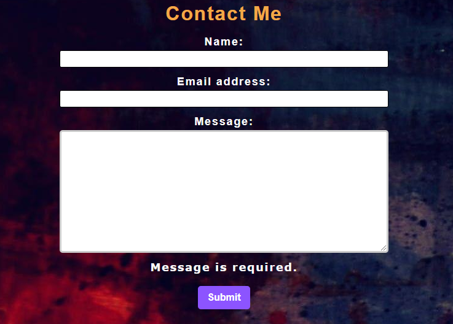
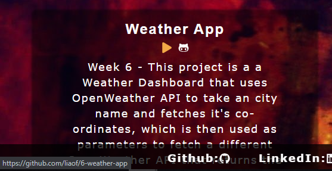
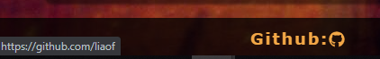

# React Portfolio

## [Deployed Application](https://liaof.github.io/challenge-20/)

## Summary
This week's project entails using React to build a portfolio. Previously in the course, we had been tasked to make a portfolio. However, because that was one of the very first projects 
given to us, naturally the level of skill that went into the first portfolio is much lower; that portfolio was served with completely hardcoded HTML files.

Using React, we are able to make a single page application which instead of reloading to a new page everytime the user wants to navigate somewhere, the links of the page simply set the url which
in turn is used to determine which page's components should be rendered. This type of web experience is advantageous when users have patchy internet; because the entire site is accessed all at once, a user only needs to connect to it a single time to be able to access any page while offline.

### Usage
After downloading the files and installing the npm packages, run 'npm run start' in your command line

### Screenshots
 
This picture shows the input validation on the contact forms; if the user clicks off the form without making a valid input, an error message detailing the exact problem will appear  
 
The utlization of useState allows the program to highlight the currently active category in the navigation bar  
  
 
Icons on the page are linked to the github page/ deployed site of each individual project, as well as a couple of my 3rd party profiles

#### Tech Used 
- react 
- react-icons 
- react-dom 
- gh-pages 